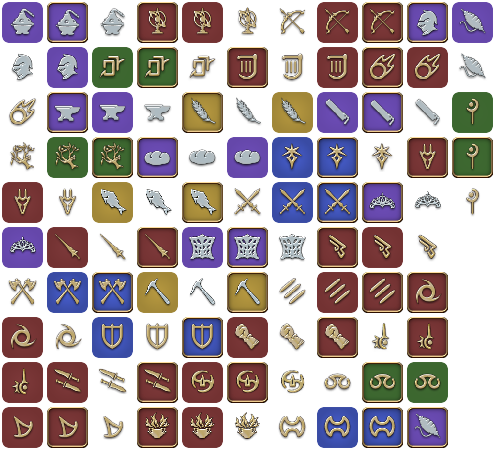

# Class/Job Icons

A collection of really nice ClassJob icons at high resolution for FINAL FANTASY XIV.

Included are:
- `font/FFXIVAppIcons.ttf` a nice font file you could use which includes all sorts of icons
- `svg/*` a whole host of SVG icons
- `icons/*` a full set of class/job plain icons using the common Silver+Gold styles.
- `misc/*` Files from the Job Guide
- `companion/*` icons from the Companion App

## Updating

- Grab the `FFXIVAppIcons.tff` file from the companion app, then you need to convert it
  - `svg`, `woff`, `otf` https://convertio.co/ttf-svg/
  - `eot` https://everythingfonts.com/ttf-to-eot

- Copy the the converted files into `src`
- Run: `converter.php` to build the font-file CSS/HTML
- Run: `svg_rip.js` to build SVG Rips.
  - This requires node, run `npm install` inside `/src` to get the module we use (`font-blast`)
